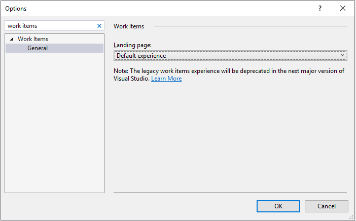

# Set the Work Items experience in Visual Studio 2019

**Azure Boards | Azure DevOps Server 2020 | Azure DevOps Server 2019 | Visual Studio 2019**  

Visual Studio 2019 supports switching between the default view of the Work Items page and the legacy view. The default view is designed to match the Work Items page available in the web portal. The legacy view supports the Work Items page available with the previous versions of Visual Studio. 

Each view supports the following tasks: 

<table width="100%">
<tbody valign="top">
<tr>
<th width="50%">Default experience</th>
<th width="50%">Legacy experience</th>
</tr>

<tr>
<td> 
<ul>
<li><a href="/azure/devops/boards/work-items/view-add-work-items" data-raw-source="[View and add work items](./view-add-work-items.md)">View and add work items</a></li>
</ul>
</td>
<td>
<li><a href="/azure/devops/boards/backlogs/add-work-items" data-raw-source="[Add work items](../backlogs/add-work-items.md)">Add work items</a></li>
<li><a href="/azure/devops/boards/queries/using-queries" data-raw-source="[Use the query editor to list and manage queries](../queries/using-queries.md)">Use the query editor to list and manage queries</a></li>
<li><a href="/azure/devops/boards/queries/set-query-permissions" data-raw-source="[Organize query folders and set query permissions](../queries/set-query-permissions.md)">Organize query folders and set query permissions</a></li>
<li><a href="/azure/devops/boards/backlogs/office/bulk-add-modify-work-items-excel" data-raw-source="[Open query in Excel](../backlogs/office/bulk-add-modify-work-items-excel.md)">Open query in Excel</a></li>
<li><a href="/azure/devops/boards/backlogs/office/create-your-backlog-tasks-using-project" data-raw-source="[Open query in Project](../backlogs/office/create-your-backlog-tasks-using-project.md)">Open query in Project</a></li>
<li><a href="/azure/devops/boards/queries/share-plans" data-raw-source="[Email query results list using Outlook](../queries/share-plans.md)">Email query results list using Outlook</a></li>
<li><a href="/azure/devops/report/create-status-and-trend-excel-reports" data-raw-source="[Create reports from query in Excel](../../report/create-status-and-trend-excel-reports.md)">Create reports from query in Excel</a> (TFS only)</li>
</ul>
</td>
</tr>
</tbody>
</table>

## Change your Work Items view

1. From Visual Studio 2019 choose **Tools>Options**.

1. In the Options dialog, enter **work items** in the search box.  

1. Choose your **Landing page** option from the menu. 

	> [!div class="mx-imgBorder"]  
	> 

To learn more about **Options**, see [Options Dialog Box (Visual Studio)](/visualstudio/ide/reference/options-dialog-box-visual-studio).

## New Git tool experience

Visual Studio 2019 now includes a new Git tool that provides an improved experience when connecting to a Git repository. When you enable this tool, the Team Explorer tool is effectively disabled when connected to a Git repository. You can acquire the new tool by downloading [Visual Studio 2019 version 16.6](/visualstudio/releases/2019/release-notes-v16.6). To enable and use the new tool, see [Git experience in Visual Studio](/visualstudio/ide/git-with-visual-studio).  

## Related articles

- [View and add work items using the Work Items page](view-add-work-items.md)