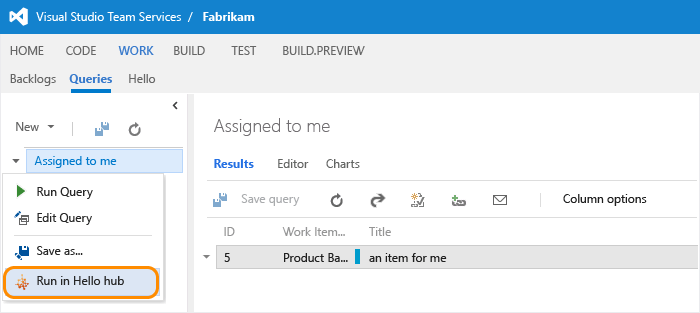

1. Add your action to the contributions section of your extension manifest.

    ```json
    "contributions": [
        {
            "id": "myAction",
            "type": "ms.vss-web.action",
            "description": "Run in Hello hub action",
            "targets": [
                "ms.vss-work-web.work-item-query-menu"
            ],
            "properties": {
                "text": "Run in Hello hub",
                "title": "Run in Hello hub",
                "icon": "images/icon.png",
                "groupId": "actions",
                "uri": "action.html"
            }
        }
    ]
    ```

   |      Property      |                                                                      Description                                                                       |
   |--------------------|--------------------------------------------------------------------------------------------------------------------------------------------------------|
   |        text        |                                                        Text that appears on the menu item.                                                         |
   |       title        |                                                    Tooltip text that appears on the menu item.                                                     |
   |        icon        |                              URL to an icon that appears on the menu item. Relative URLs are resolved using baseUri.                               |
   |      groupId       | Determines where this menu item appears in relation to the others. [How to discover menu group identifiers](../../overview.md) |
   |        uri         |                                           URI to a page that registers the menu action handler (see below).                                            |
   | registeredObjectId |                                (Optional) Name of the registered menu action handler. Defaults to the contribution id.                                 |


2. Add an HTML page called ```action.html``` to your web app to handle your action.

    ```html
    <!DOCTYPE html>
    <html lang="en">
    <head>
        <meta charset="UTF-8">
        <title>Action Sample</title>
    </head>
    <body>
        <div>
            The end user doesn't see the content on this page.
            It is only in the background to handle the contributed menu item being selected.
        </div>
    </body>
    </html>
    ```

3. Register a handler object to handle your action. For now, just raise an alert.

    ```html
    <script src="sdk/scripts/VSS.SDK.js"></script>
    <script>
         VSS.init();

         // Use an IIFE to create an object that satisfies the IContributedMenuSource contract
         var menuContributionHandler = (function () {
            "use strict";
            return {
                // This is a callback that gets invoked when a user selects the newly contributed menu item
                // The actionContext parameter contains context data surrounding the circumstances of this
                // action getting invoked.
                execute: function (actionContext) {
                    alert("Hello, world");
                }
            };
        }());

        // Associate the menuContributionHandler object with the "myAction" menu contribution from the manifest.
        VSS.register("myAction", menuContributionHandler);
    </script>
    ```

4. Install your extension and try it out.
   The action has been added to the context menu for queries and folders in the queries hub (work hub group).

    