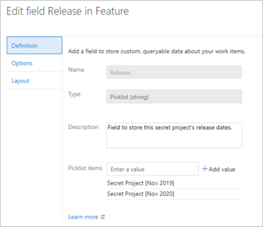

# Resources granted to project members

[!INCLUDE [version-all](../../includes/version-all.md)]

An Azure DevOps project is a container and security boundary for your software development assets: work items, code, builds, etc.
When you add someone as a member of a project, you are also trusting that person with some additional privileges.
A project member has access to organization-level resources and additional groups (or scopes) beyond the project.
If someone is not already a member of your organization, when you add them to a project, you implicitly grant them this additional access.  

 
::: moniker range="azure-devops"  

> [!NOTE]  
> If the **Limit user visibility for projects** preview feature is enabled for the organization, users added to the **Project-Scoped Users** group won't be able to access projects that they haven't been added to. To learn more, see [About projects and scaling your organization, Project-scoped Users group](../../organizations/projects/about-projects.md#project-scoped-user-group). 

::: moniker-end  

## Additional groups and scopes

Under the hood, a project member belongs to one or more [project-related security groups](../security/about-permissions.md#security-group-membership) such as "Project Valid Users" and "Project Contributors".
That person is also a member of an organization-level group known as "Project Collection Valid Users".
Also, that person's identity appears in the [identity service](../security/about-security-identity.md#authentication) which backs the organization. 
User accounts backed by [Azure Active Directory](/azure/active-directory/) can have [native identities](/azure/active-directory/add-users-azure-active-directory) or [guest identities](/azure/active-directory/active-directory-b2b-what-is-azure-ad-b2b), which grant different levels of access.

## Organization-level resources 

Project members have access to resources beyond the specific project. 
Those resources include those defined at the organization-level (cloud) or project collection level (on-premises):

* Information about other members, including their email address and other contact details, that is hidden from non-members.
* The Settings area, including security groups and permissions.
* All installed extensions.
* [Process](../settings/work/manage-process.md) metadata from all processes in the organization, which includes the work item types, its fields and picklist items. Picklist items could show sensitive information such as release dates, as shown in the following image:

  

* When the WIT Client OM is used, which includes the usage of Excel and Visual Studio integration, it stores sensitive information in a cache on the local disk. This cache includes the metadata of all processes in the organization and the identities and group memberships of all members of the organization.
* When a user is added to the project-level Build Administrators group, they have the ability to create pipelines which run with project collection (account-wide) scope. A pipeline with project collection scope may access resources in another project, such as Git repositories, that the user cannot. (You can change this by [removing the Read permission from Project Collection Build Service](../security/set-git-tfvc-repository-permissions.md#pcbs-has-read-by-default)).

## The trust decision

These resources and groups are required for the proper functioning of a member of a project.
Your collaborators are typically colleagues and others with whom you have an existing relationship.
Before you add someone from outside this trusted group, think carefully about whether they should have access to the previously mentioned items.
