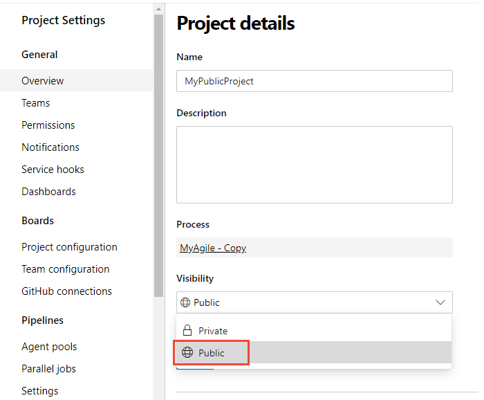

# Change the project visibility, public or private

[!INCLUDE [temp](includes/version-public-projects.md)]  

Learn how to change the visibility of your project to and from public or private. Users who aren't signed in to your organization have read-only access to public projects on Azure DevOps. Private projects, on the other hand, require users to be granted access to the project and signed in to access the services.
You can easily switch a private project to a public project, and vice-versa.  Before you do so, review the notes provided in [Private-to-public migration checklist](migration-checklist.md). 

> [!TIP]  
> Look through our [migration checklist](migration-checklist.md) before you make an existing project public.
> It has tips and ideas for exposing a limited set of data, in case you don't want your entire history available.

## Prerequisites

- You must have an organization created in Azure DevOps. If you don't have one, [do that now](../../user-guide/sign-up-invite-teammates.md).
- As an organization owner, you can change policies and change project information. If you're not the owner, then you must be [a member of the Project Collection Administrators Group](../security/set-project-collection-level-permissions.md#collection-level).

## Enable anonymous access to projects for your organization

Before you can change a private project, to a public project, you must enable anonymous access for your organization.

1. From your web browser, sign in to Azure DevOps. You must be signed in to create a public project.

2. Choose :::image type="icon" source="../../media/icons/project-icon.png" border="false"::: **Azure DevOps** to open **Projects**. Then choose **Organization settings**.

	> [!div class="mx-imgBorder"]  
	>   

3. Choose the **Policies** page, and select **On** for **Allow public projects**.

	> [!div class="mx-imgBorder"]  
	> 

## Make a private project public, or a public project private

1. Choose **Project Settings** in the sidebar.

	> [!div class="mx-imgBorder"]  
	>   

2. Choose **Overview**.  

3. To switch from private to public, choose **Public** from the **Visibility** menu of options.  

	> [!div class="mx-imgBorder"]  
	>  

	To switch from public to private, choose **Private** from the **Visibility** menu of options.

4. Choose **Save**.   

## Next steps

> [!div class="nextstepaction"]
> [Download code](browse-code-public.md)

