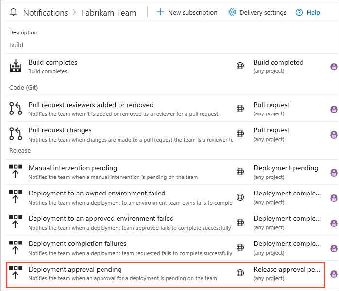

# Release deployment control using approvals

[!INCLUDE [version-tfs-2015-rtm](../../includes/version-tfs-2015-rtm.md)]

::: moniker range="<= tfs-2018"
[!INCLUDE [temp](../../includes/concept-rename-note.md)]
::: moniker-end

When a release is created from a release pipeline that defines
approvals, the deployment stops at each point where approval is required
until the specified approver grants approval or rejects the release (or
re-assigns the approval to another user).
You can enable manual deployment approvals for each stage in a release pipeline.

## Define a deployment approval

You can define approvals at the start of a stage (pre-deployment approvers), 
at the end of a stage (post-deployment approvers), or both. For details of 
how to define and use approvals, see [Add approvals within a release pipeline](../define-multistage-release-process.md#add-approvals).

* For a **pre-deployment** approval, choose the icon at the entry point of the stage
   and enable pre-deployment approvers.
* For a **post-deployment** approval, choose the icon at the exit point of the stage
   and enable post-deployment approvers.

You can add multiple approvers for both pre-deployment and post-deployment settings.
These approvers can be individual users or groups of users. These users must have the
[View releases](../../policies/permissions.md#set-release-permissions) permission.

When a group is specified as an approver, only one of the users in that group needs to approve
for the deployment to occur or the release to move forward.

   * If you are using **Azure Pipelines**, you
     can use local groups managed in Azure Pipelines or
     Azure Active Directory (Azure AD) groups if they have been
     added into Azure Pipelines.
   * If you are using **Team Foundation Server** (TFS),
     you can use local groups managed in TFS or Active
     Directory (AD) groups if they have been added into TFS.

The creator of a deployment is considered to be a separate user
role for deployments. For more details,
see [Release permissions](../../policies/permissions.md#set-release-permissions).
Either the release creator or the deployment creator can be restricted from approving deployments.

If no approval is granted within the **Timeout** specified for the approval, the deployment is rejected.

Use the **Approval policies** to:

   * Specify that the user who requested (initiated or created) the release cannot approve it.
     If you are experimenting with approvals, uncheck this option so that you can approve or reject your own deployments.
     For information about the ID of the requester for CI/CD releases, see [How are the identity variables set?](../../build/variables.md#how-are-the-identity-variables-set)
   * Force a revalidation of the user identity to take into account recently changed permissions.
   * Reduce user workload by automatically approving subsequent prompts if the specified
     user has already approved the deployment to a previous stage in the pipeline
     (applies to pre-deployment approvals only). Take care when using this option; for example, you may
     want to require a user to physically approve a deployment to production even though that user has
     previously approved a deployment to a QA stage in the same release pipeline.  

For information about approving or rejecting deployments, and viewing approval logs, see
[Create a release](../define-multistage-release-process.md#create-release),
[View the logs for approvals](../deploy-using-approvals.md#view-approvals), and
[Monitor and track deployments](../define-multistage-release-process.md#monitor-track).

### Approval notifications

Notifications such as an email message can be sent to the approver(s) defined for
each approval step. Configure recipients and settings in the **Notifications** section of the 
[project settings page](../../../project/navigation/go-to-service-page.md#open-project-settings).

  
The link in the email message opens the **Summary** page for the release
where the user can approve or reject the release.

## Related articles

* [Approvals and gates overview](index.md)
* [Manual intervention](../deploy-using-approvals.md#configure-maninter)
* [Stages](../../process/stages.md)
* [Triggers](../triggers.md)

[!INCLUDE [rm-help-support-shared](../../includes/rm-help-support-shared.md)]
