# Get feedback

[!INCLUDE [temp](../../includes/version-all.md)]

Once you have working software, you're ready to get feedback from your stakeholders. You can ask reviewers to provide videos, screenshots, type-written comments, and ratings. Their feedback is captured into work items that you can review and use to create a bug or suggest a new backlog item. 

Before requesting feedback, make sure that you [provide stakeholders who'll you request feedback from the necessary permissions](give-permissions-feedback.md).

::: moniker range=">= tfs-2017"

> [!NOTE]
> You can also [request feedback from stakeholders for web apps using the Test &amp; Feedback extension](../../test/request-stakeholder-feedback.md). For desktop apps, you must use the feedback request form documented in this topic and stakeholders must reply using the Microsoft Feedback Client. 

::: moniker-end

## Prerequisites

::: moniker range="azure-devops"

* You must connect to a team project. If you don't have a project yet, create one in [Azure DevOps Services](../../user-guide/sign-up-invite-teammates.md).  
* You must be added to a project as a member of the **Contributors** or **Project Administrators** security group. To get added, [Add users to a project or team](../../organizations/security/add-users-team-project.md).  
* To request feedback, you must be granted **Basic** access or higher. For details, see [About access levels](../../organizations/security/access-levels.md).
* To provide or review feedback, you must be granted **Stakeholder** access or higher. 
* To view or modify feedback responses, you must have your **View work items in this node** and **Edit work items in this node** permissions set to **Allow**.  By default, the **Contributors** group has this permission set. To learn more, see [Set permissions and access for work tracking](../../organizations/security/set-permissions-access-work-tracking.md).  

> [!NOTE]  
> Users with **Stakeholder** access for a public project have full access to the Request feedback feature just like users with **Basic** access. For details, see [About access levels](../../organizations/security/access-levels.md).

::: moniker-end

::: moniker range=">= tfs-2017 < azure-devops"

* You must connect to a project. If you don't have a project yet, [create one](../../organizations/projects/create-project.md).
* You must be added to a project as a member of the **Contributors** or **Project Administrators** security group. To get added, [Add users to a project or team](../../organizations/security/add-users-team-project.md). 
* To request feedback, you must be granted **Basic** access or higher. For details, see [About access levels](../../organizations/security/access-levels.md).
* To provide or review feedback, you must be granted **Stakeholder** access or higher. 
* To view or modify feedback responses, you must have your **View work items in this node** and **Edit work items in this node** permissions set to **Allow**.  By default, the **Contributors** group has this permission set. To learn more, see [Set permissions and access for work tracking](../../organizations/security/set-permissions-access-work-tracking.md).  
* To send feedback requests, the server administrator must [configure an SMTP server](/azure/devops/server/admin/setup-customize-alerts).

::: moniker-end 

::: moniker range="tfs-2015"

* You must connect to a project. If you don't have a project yet, [create one](../../organizations/projects/create-project.md).
* You must be added to a project as a member of the **Contributors** or **Project Administrators** security group. To get added, [Add users to a project or team](../../organizations/security/add-users-team-project.md). 
* To request feedback, you must be granted **Basic** access or higher for TFS 2015.1 and later versions. For TFS 2015, you must be granted **Advanced** access. For details, see [About access levels](../../organizations/security/access-levels.md).
* To provide or review feedback, you must be granted **Stakeholder** access or higher. 
* To view or modify feedback responses, you must have your **View work items in this node** and **Edit work items in this node** permissions set to **Allow**.  By default, the **Contributors** group has this permission set. To learn more, see [Set permissions and access for work tracking](../../organizations/security/set-permissions-access-work-tracking.md).  
* To send feedback requests, the server administrator must [configure an SMTP server](/azure/devops/server/admin/setup-customize-alerts).

::: moniker-end 

::: moniker range="tfs-2013"

* You must connect to a project. If you don't have a project yet, [create one](../../organizations/projects/create-project.md).
* You must be added to a project as a member of the **Contributors** or **Project Administrators** security group. To get added, [Add users to a project or team](../../organizations/security/add-users-team-project.md). 
* To request feedback, you must be granted **Advanced** access. For details, see [About access levels](../../organizations/security/access-levels.md).
* To add or modify work items, you must be granted **Stakeholder** access or higher. For details, see [About access levels](../../organizations/security/access-levels.md).
* To view or modify work items, you must have your **View work items in this node** and **Edit work items in this node** permissions set to **Allow**.  By default, the **Contributors** group has this permission set. To learn more, see [Set permissions and access for work tracking](../../organizations/security/set-permissions-access-work-tracking.md).  
* To send feedback requests, the server administrator must [configure an SMTP server](/azure/devops/server/admin/setup-customize-alerts).

::: moniker-end 

::: moniker range=">= tfs-2015"  

## Add the Other links widget to your dashboard

Add the **Other links** widget to a web portal team dashboard. For details, see [Add widgets to a dashboard](../../report/dashboards/add-widget-to-dashboard.md)  

> [!div class="mx-imgBorder"]  
> 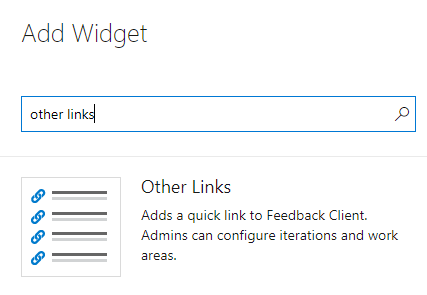   

::: moniker-end 

## Request feedback 

To request feedback, you fill out a form that generates an email request to your stakeholders.

::: moniker range=">= azure-devops-2020"  

1. From the dashboard, choose the **Request feedback** link from the Other links widget.  

	  

1. Add the feedback reviewers. If you don't see the names you want in the browse list, [grant them permissions to provide feedback](give-permissions-feedback.md).

	  

2. Tell your reviewers how to run the app they'll be reviewing.

	  

3. For each area of interest, decide what type of feedback you want. Set the context for the reviewers by providing enough background information. Add up to four more areas of interest with the **add feedback item** link. 

	  

4. Send the request. 

	  

::: moniker-end 

::: moniker range=">= tfs-2015 <= azure-devops-2019" 

1. From the dashboard, choose the **Request feedback** link from the Other links widget.  

	  

	If the following message appears, you need to [configure an SMTP server](/azure/devops/server/admin/setup-customize-alerts).

	  

1. Add the feedback reviewers. If you don't see the names you want in the browse list, [grant them permissions to provide feedback](give-permissions-feedback.md).

	  

2. Tell your reviewers how to run the app they'll be reviewing.

	  

3. For each area of interest, decide what type of feedback you want. Set the context for the reviewers by providing enough background information. Add up to four more areas of interest with the **add feedback item** link. 

	  

4. Send the request. 

	  

::: moniker-end 

::: moniker range="<= tfs-2013"  

1. From the web portal team home page, choose **Request feedback** to start a feedback request. 

	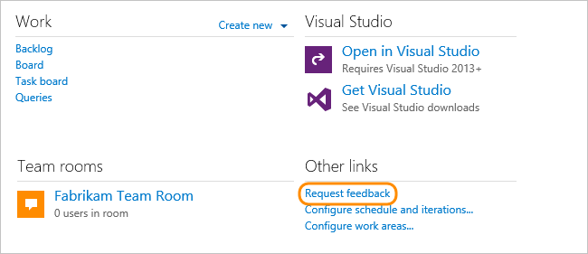  

	> [!NOTE]  
	> If your on-premises TFS team project was upgraded from TFS 2010 or earlier version, you may have to update your team project using the [Configure Features wizard](/previous-versions/azure/devops/reference/upgrade/configure-features-after-upgrade). 

	If the following message appears, you need to [configure an SMTP server](/azure/devops/server/admin/setup-customize-alerts).

	  

2. Add the feedback reviewers. If you don't see the names you want in the browse list, [grant them permissions to provide feedback](give-permissions-feedback.md).

	  

3. Tell your reviewers how to run the app they'll be reviewing.

	  

4. For each area of interest, decide what type of feedback you want. Set the context for the reviewers by providing enough background information. Add up to four more areas of interest with the **add feedback item** link. 

	  

5. Send the request. 

	  

::: moniker-end 

## Provide feedback

Reviewers launch your application and provide feedback through the free Microsoft Feedback Client.

1. Reviewers who don't have a version of Visual Studio installed can download the feedback client directly from the feedback request they receive.

	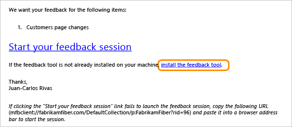  

	Or, they can go to the [Visual Studio download site](https://www.microsoft.com/download/details.aspx?id=48142). 

2. Reviewers start the feedback session.

	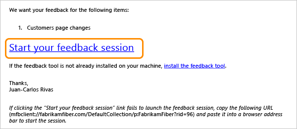  

3. They launch the app to review from the feedback tool.

	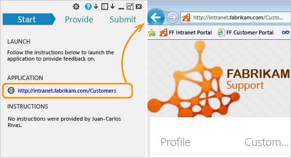  

4. They begin providing feedback.

	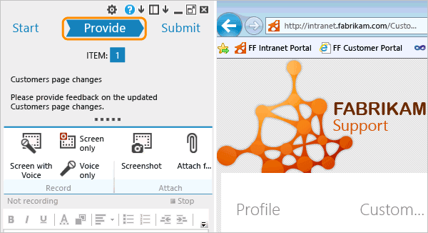  

5. Reviewers can add screenshots, comments, and file attachments, and even record the feedback session. Results show up on the lower part of the screen. In this case, you can see the comment that the stakeholder wrote after attaching the screenshot. 

	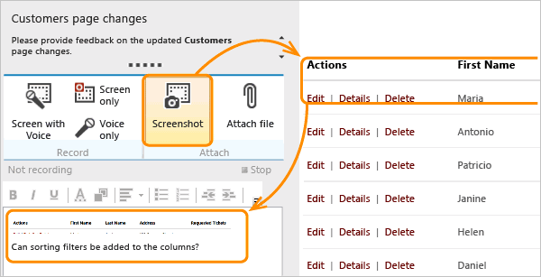  

	> [!NOTE]
	> **Security Note:** Unless you stop recording, everything is recorded&mdash;all steps that you take as well as anything you say. If you provide sensitive data such as user names and passwords, you will capture this information in the recording. However, you can always delete a recording by deleting the image for the recording session that appears in the feedback tool's text box.   

6. Reviewers can modify or even delete parts of their feedback, such as a recording, before they submit their feedback.

	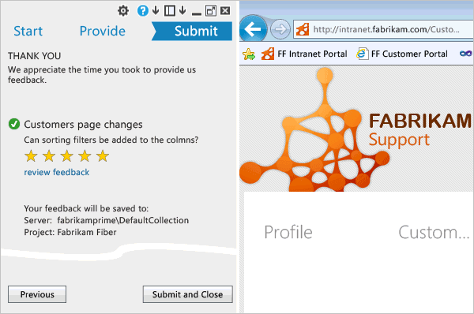  

## Review feedback

1. Open the Feedback query. 

	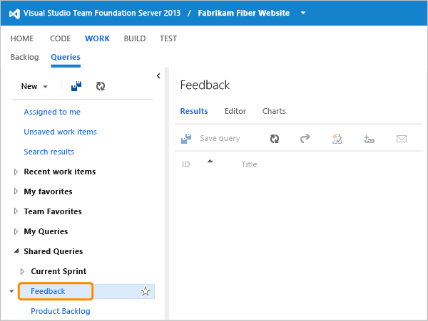  

	Or, create a feedback query with the parameters, as shown.

	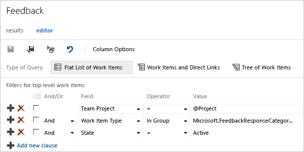  

	You should see a list of all active feedback responses for your team project. 

	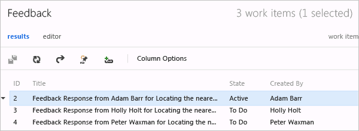  

2. Open a response item and play or save a recording.

	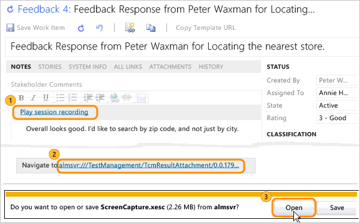   

3. Or, you can create a bug or backlog item linked to the feedback. 

	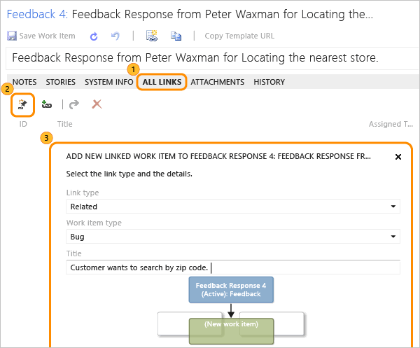  

	With the feedback experience, you can engage stakeholders frequently to provide continuous feedback. Interacting with your working apps, your stakeholders can record rich and actionable data that the system automatically stores in the form of video or audio recordings, comments, and annotated screenshots. You can then take action on each feedback response by assigning it to a team member or creating bugs or backlog items to the linked feedback. 

## Related notes  

- You can [change the audio device or annotation tool](change-audio-device-annotation-tool.md) using the Settings icon change settings icon on the Microsoft Feedback Client.  
- If you access the Microsoft Feedback Client from a remote machine, you can [enable remote audio](enable-remote-audio-capture.md).  
- You can install the Test & Feedback extension from the Marketplace, [Test & Feedback](https://marketplace.visualstudio.com/items?itemName=ms.vss-exploratorytesting-web).