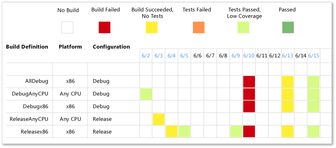
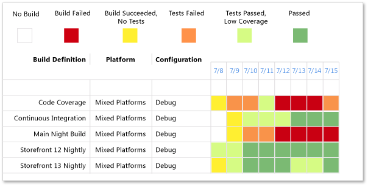

# Build Success Over Time Report

[!INCLUDE [temp](../includes/tfs-report-platform-version.md)]

The Build Success Over Time report provides a pictorial version of the Build Summary report. The Build Success Over Time report displays the status of the last build for each build category run for each day. You can use this report to help track the quality of the code that the team is checking in. In addition, for any day on which a build ran, you can view the Build Summary for that day.  
  
> [!IMPORTANT]  
> This report is only applicable for XAML builds, which are deprecated for TFS 2018 and later versions. If your build process isn't based on XAML builds, this report and the TFS Warehouse for builds won't yield any meaningful data.  

 For information about how to access, refresh, or manage reports, see [Reporting Services Reports](reporting-services-reports.md).  
  
> [!NOTE]
>  This report requires that the team project collection that contains your team project was provisioned with SQL Server Reporting Services. This report is not available if  **Reports** does not appear when you open Team Explorer and expand your team project node.  
  
**You can use this report to answer the following questions**:   -   What parts of the project have produced software that is ready to be tested? -   What parts of the project are having trouble with regressions or bad checkins? -   How well is the team testing the code? 
  
 **Required Permissions**  
  
 To view the report, you must be assigned or belong to a group that has been assigned the **Browser** role in Reporting Services. For more information, see [Add users to team projects](../admin/grant-permissions-to-reports.md).  
  
##   Data That Appears in the Report  
 The data that appears in the Build Success Over Time report is derived from the data warehouse. The report summarizes build and test results for a set of build definitions in one or more projects over time.  
  
 The chart shows a separate row for each combination of build definition, platform, and configuration. The report shows only those combinations that fall within the filters that you have specified for the report. At a glance, you can determine the success or failure of builds for the time period under review, as the following illustration shows.  
  
   
  
 The daily results of runs of build definitions appear in the colors that the following table describes:  
  
|Build status|Color|Indicates|  
|------------------|-|-----------|---------------|  
|Passed|:::image type="icon" source="media/procguid_buildsuccess_green.png" border="false"::: Green|-   Build succeeded. -   All tests completed successfully. -   Code coverage was good.|  
|Tests Passed, Low Coverage|:::image type="icon" source="media/procguid_buildsuccess_lightgreen.png" border="false"::: Light&nbsp;green|-   Build succeeded. -   All tests completed successfully. -   Code coverage was minimal.|  
|Build Succeeded, No Tests|:::image type="icon" source="media/procguid_buildsuccess_yellow.png" border="false"::: Yellow|-   Build succeeded. -   No tests were run.|  
|Build Failed|:::image type="icon" source="media/procguid_buildsuccess_red.png" border="false"::: Red|-   Build ran but did not pass. -   At least one test failed that did not previously fail. Either the test is new or the test passed in previous test runs.|  
|Tests Failed|:::image type="icon" source="media/procguid_buildsuccess_orange.png" border="false"::: Orange|-   Build failed due to a compile error or other error.|  
|No build|:::image type="icon" source="media/procguid_buildsuccess_white.png" border="false"::: White|-   Build was not run on this day.|  
  
 You can filter the report in the following ways:  
  
- Change the start and end dates for the report.  
  
- Filter the build definitions by specifying the platforms, configurations, and build definitions to include in the report.  
  
  For more information, see [Filtering the Report](#Changing) later in this article.  
  
### Required Build Management Activities  
 For the Build Success Over Time report to be useful, team members must perform the following activities to manage builds:  
  
-   **Configure a build system**. To use Team Foundation Build, you must set up a build system.  
  
     For more information, see [Build and Release agents](../../pipelines/agents/agents.md).
  
-   **Create build definitions**. You can create several build definitions, each of which can be run to produce code for a different platform. Also, you can run each build for a different configuration.  
  
     For more information, see [Get started with CI/CD](../../pipelines/create-first-pipeline.md).
  
-   **Run builds regularly**. You can run builds can be run at set intervals or after every check-in. You can schedule regular builds when you use the schedule trigger. For more information, see [Build triggers](../../pipelines/build/triggers.md).
  
    > [!NOTE]
    >  Although a team member can manually rate a build by using Build Explorer, this rating is not reflected in the Build Success Over Time report. The build rating appears in the Build Summary report. For more information, see [Rate the quality of a completed build](/previous-versions/ms181734(v=vs.140)) and [Build Summary](build-summary-report.md).  
  
##   Setting the Duration of the Report  
 To understand the progress that your team is making in your current iteration, the start and end dates for the report must match those of your current iteration cycle.  
  
#### To change the duration of the iteration  
  
1.  Next to **Iteration Start (Date)** or **Iteration End (Date)**, click the calendar icon, and then click a date.  
  
2.  Click **View Report**.  
  
##   Interpreting the Report  
 You should expect the Build Success Over Time report to vary based on where you are in your product development cycle. Early iterations often exhibit some builds and tests failing. By reviewing the report together with the team early and often, you might be better able to focus efforts toward creating stable builds with high rates of tests passing.  
  
### Questions That the Report Answers  
 You can review the Build Success Over Time report to find answers to these questions:  
  
- How high is the quality of the builds?  
  
- Is the quality improving, deteriorating, or staying constant?  
  
- What parts of the project are ready to test?  
  
- What parts of the project are having trouble with regressions or bad checkins?  
  
- How well is the code tested?  
  
  Team members should review the last column of the Build Success Over Time report to determine whether the most recent builds have passed. If long sections in the report are not green, project managers and development leads should determine the root of persistent problems.  
  
### Healthy and Unhealthy Versions of Report  
 A healthy Build Success Over Time report will show successive days of green, which indicate that builds are passing. An unhealthy version of the report will show long blocks of orange or red. These blocks indicate that builds are not passing or that tests are failing. The following illustration shows that some builds are in good shape and some need investigation:  
  
   
  
##   Filtering the Report  
 You can filter the Build Success Over Time report in the following ways:  
  
- Change the start and end dates for the report.  
  
- Filter the builds that appear in the report by specifying the platform, configuration, and build definitions to include.  
  
  > [!NOTE]
  >  You can configure build definition to run no tests, some tests, or all tests. The report will vary greatly based on the configuration of the build definitions.  
  
  The following illustration shows the available filters:  
  
    
  
  You must apply the filters in the sequence that the following procedure specifies. The options that are available with some filters depend on the filters that you applied previously.  
  
#### To filter the builds that appear in the report  
  
1.  In the **Platform** list, select the check box of each platform to include.  
  
2.  In the **Configuration** list, select the check box of each configuration to include.  
  
3.  In the **Build Definition** list, select the check box of each build definition to include.  
  
4.  Click **View Report**.  
  
## Related notes
 [Reporting Services Reports](reporting-services-reports.md)