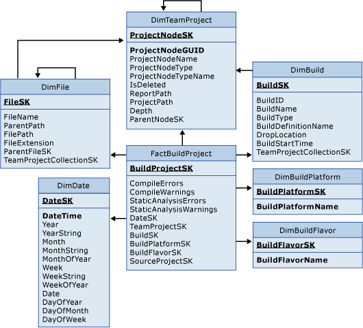

# Build Project tables 

[!INCLUDE [temp](../includes/tfs-report-platform-version.md)]

You can query for data about the files and projects that were built and information about those files by using FactBuildProjects and the associated dimensions. Records contain the static analysis and compiler warnings and errors for each file that was built. If it was built for more than one platform or flavor, you can find records for each platform and flavor.  
 
> [!IMPORTANT]  
> Build tables are only applicable for XAML builds, which are deprecated for TFS 2018 and later versions. If your build process isn't based on XAML builds, these tables and the TFS Warehouse for builds won't yield any meaningful data.  
 
For information about the measures and dimensions that are associated with these tables in the SQL Server Analysis Services cube, see [Builds](perspective-build-analyze-report-build-details-coverage.md).  
  
  
  
FactBuildProject is associated with the following dimension tables:  
  
-   DimBuild  
-   DimBuildFlavor    
-   DimBuildPlatform    
-   DimDate    
-   DimFile    
-   DimTeamProject  
  
## Related notes
-  [Builds](perspective-build-analyze-report-build-details-coverage.md)   
-  [Build Quality Indicators](build-quality-indicators-report.md)   
-  [Build Success Over Time](build-success-over-time-report.md)   
-  [Build Summary](build-summary-report.md)   
-  [Build Details tables](table-reference-build-details.md)   
-  [Table reference for the relational warehouse database](table-reference-relational-warehouse-database.md) 
- [Continuous integration on any platform](../../pipelines/get-started/what-is-azure-pipelines.md)