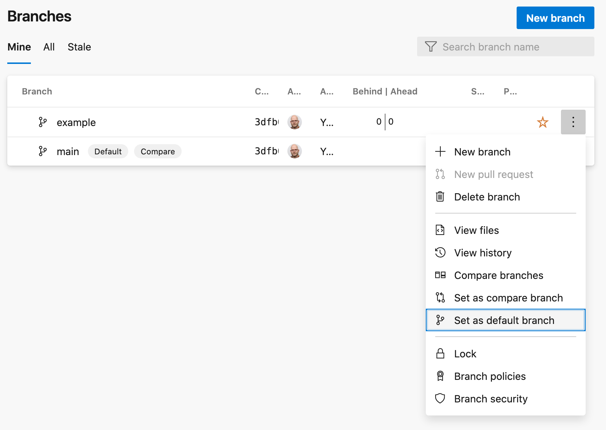

>[!NOTE]
>This step requires [Edit Policies permissions](../../../organizations/security/set-git-tfvc-repository-permissions.md#git-repository) on your Git repo.

Configure your Git repo to use a different default branch to merge code into when your team creates new pull requests.
You can use a branch other than `main` for new changes or change your main line of development in your repo. To change the default branch name for new repositories, see [All repositories settings and policies](../repository-settings.md#all-repositories-settings-and-policies).

::: moniker range=">= azure-devops-2019"

1. [Navigate](../../../project/navigation/go-to-project-repo.md) to your repository and select **Branches**.

1. Select the desired new default branch.
You need at least two branches in order to change the default.
If there's only one, it will already be the default branch.
In that case, you must create a second one in order to change the default.

1. Select the **...** beside the desired branch and choose **Set as default branch**.

   

1. Once you've set the new default branch, you may delete the previous one if desired.

::: moniker-end

::: moniker range="<= tfs-2018"

1. Select the settings button in your project open to open the project administration page.

   

1. Select **Version Control**.

1. Select your Git repository. Your branches are displayed under your repo.

1. Select the **...** next to the branch you want to set as default, then select **Set as default branch**.

   

1. Once you've set the new default branch, you may delete the previous one if desired.

::: moniker-end
