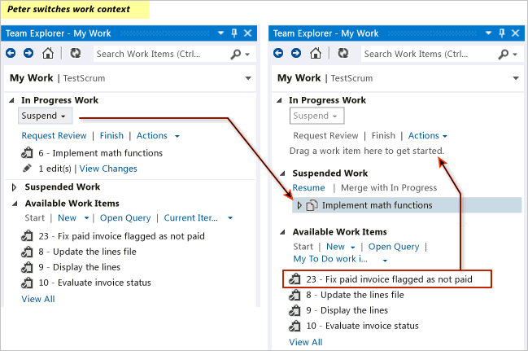
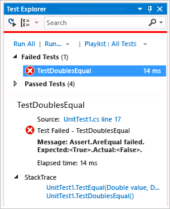
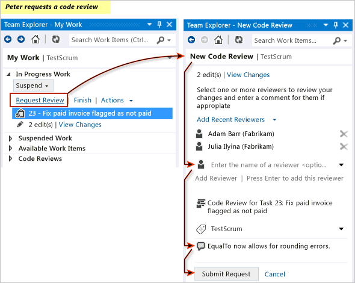
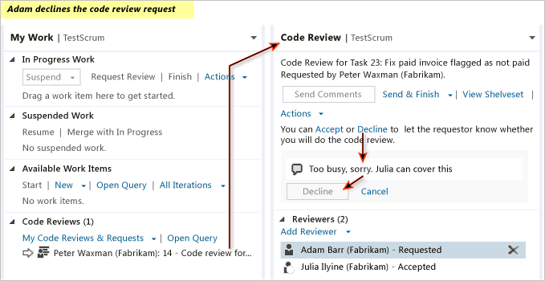
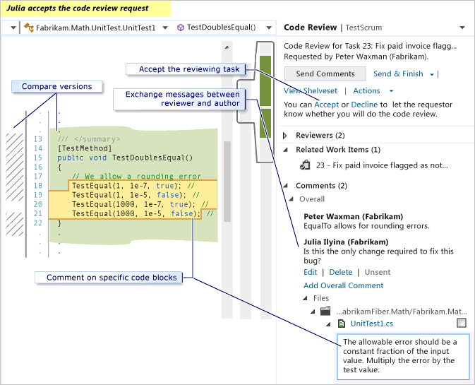
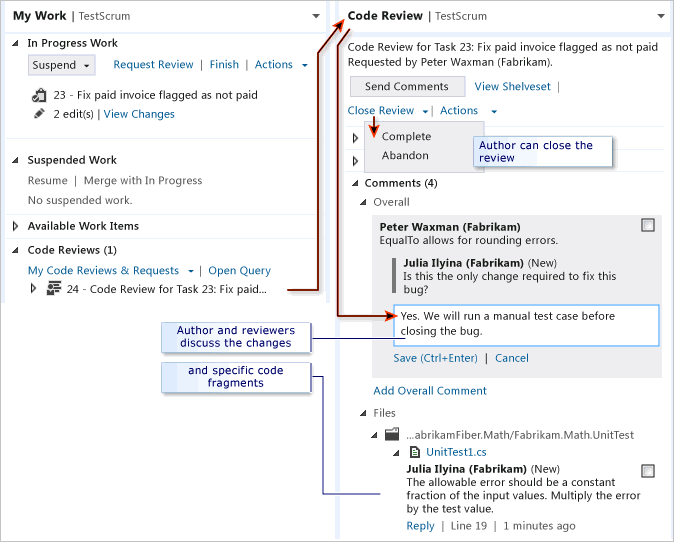
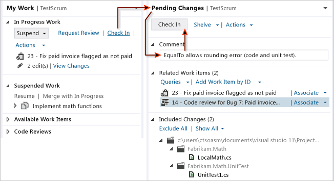
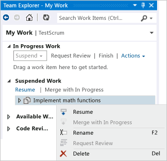
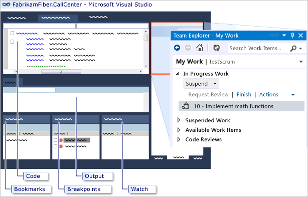

---
title: Suspend work, fix a bug, and conduct a code review
titleSuffix: Azure Repos
description: Day in the life of a devops developer. Suspend work, fix a bug, and conduct a code review.
ms.assetid: 2fc2a1ff-70a2-4b4e-8dff-73238628f956
ms.technology: devops-code-tfvc
ms.topic: tutorial
ms.date: 08/25/2016
monikerRange: '>= tfs-2015'
---


# Day in the life of a devops developer: suspend work, fix a bug, and conduct a code review

**Azure Repos | Azure DevOps Server 2020 | Azure DevOps Server 2019 | TFS 2018 | TFS 2017 | TFS 2015 | VS 2017 | VS 2015 | VS 2013**

A powerful one-click way to switch your working context from one thread of work to another is available in Visual Studio Premium and Visual Studio Ultimate with Team Foundation Server. Also, team members can easily exchange messages about proposed changes to the code. This topic illustrates these features, continuing a tutorial that follows members of a fictitious agile team for a day.

[Peter has been busy writing some code to fulfill a backlog item task.](day-life-alm-developer-write-new-code-user-story.md) However, [his colleagues have found a bug](day-life-alm-developer-suspend-work-fix-bug-conduct-code-review.md) that is blocking them, and he wants to fix it immediately. He suspends the work that he's doing and fixes the bug. He asks Julia to review the fix and, after the review, checks in the fix and resumes work on his original task.

> [!NOTE]
> The My Work and Code Review features that Peter uses are available only in Visual Studio Premium and Visual Studio Ultimate.

## Suspend current work

As Peter works on a backlog item, Julia comes to discuss a bug that is blocking her. It is in an area with which Peter is familiar, so he creates a task to fix the bug and assigns it to himself. He decides to start work on the fix immediately.

Before he starts to work on the new bug, Peter wants to make sure that his current work is set aside in a safe place on the team's server. On the **My Work** page, Peter chooses **Suspend** to save (on Team Foundation Server):

-   All the work he has done, including changes to code, tests, and other files.

-   Open solutions, windows, breakpoints, watch window variables, and other bits of Visual Studio state.

Now that his workspace is clean, Peter drags the new task from **Available Work Items** to **In Progress Work**. He's ready to research and write the fix.

> [!NOTE]
> Your working context is linked to the work items that show as In Progress on the My Work page. By using **Suspend** and **Resume**, you can quickly switch between different tasks. Your open solutions and files, code changes, and Visual Studio layout are all switched together.

### To suspend current work and begin work on a different task

 
1.  **Connect:** If you are not already connected to the project that you want to work in, then [connect to the project](../../organizations/projects/connect-to-projects.md):

    1.  In **Team Explorer**, choose  **Home**, and then choose  **My Work**.

2.  **Suspend** your current task:

    1.  In the **In Progress Work** section, choose **Suspend**.

    2.  In the box that appears, specify the name that you want to give this set of suspended work, and then choose the **Suspend** button. The default name is your currently in progress work item.

3.  **Start work on a new task**, bug, or other work item:

    1.  Before selecting a work item, you might want to:

        -   Create a new task or other work item by choosing **New** under **Available Work Items**; or

        -   Select a different query under **Available Work Items**.

    2.  Drag a work item from **Available Work Items** to **In Progress Work**.

        Alternatively, you can switch to a work item that you previously suspended by dragging it from under **Suspended Work**.

> [!TIP]
> The currently In Progress work items link to your current code changes and Visual Studio state. To allow Visual Studio to help you organize your work, make sure that the appropriate items are in the In Progress state when you switch from one task to another.

## Investigate the bug

Peter opens and reads the bug work item. According to the description that has been written by a member of the test team, a paid invoice is sometimes incorrectly flagged as unpaid. There is a lab environment snapshot attached to the bug work item. Peter is able to open the virtual machines on which the test was run, see the incorrect invoice, and step back through the IntelliTrace log. He traces the fault to the following method:

```csharp
public class LocalMath
{
    public static bool EqualTo(double a, double b)
    {
        return a == b;
    }
```

From the IntelliTrace log, Peter sees that sometimes the method returns false because the parameters differ by an extremely small amount. Peter knows that rounding errors of this kind are unavoidable in floating point arithmetic, and that it is bad practice to test floating point numbers for equality.

## Augment the tests to show the error
When a bug is found, it shows that there was a gap in the unit tests, or that the test did not match the users' actual needs. Therefore, before fixing the bug, Peter adds a test that will demonstrate the presence of this error.

```csharp
// Added 2012-02-02 for bug 654321:
/// <summary>
/// Make sure that number equality test allows for 
/// small rounding errors.
/// </summary>
[TestMethod]
public void TestDoublesEqual()
{
    // We allow a rounding error of 1 in 1000000:
    TestEqual(1, 1e-7, true); // Less than allowed error
    TestEqual(1, 1e-5, false); // More than allowed error
    TestEqual(1000, 1e-7, true); // Less than allowed error
    TestEqual(1000, 1e-5, false); // More than allowed error
}
private void TestEqual(double value, double error, bool result)
{
    // Try different combinations of error and value:
    Assert.IsTrue(result == LocalMath.EqualTo(value + error, value));
    Assert.IsTrue(result == LocalMath.EqualTo(value, value + error));
    Assert.IsTrue(result == LocalMath.EqualTo(value - error, value));
    Assert.IsTrue(result == LocalMath.EqualTo(value, value - error));
}
```

He runs the test and it fails as expected.



## Make the tests pass
Peter fixes the code:

```csharp
public static bool EqualTo(double a, double b)
{
    // Allow for rounding errors.
    // For example, a == 2.0 and b = 1.99999999999

    const double allowedError = 1/1000000;
    return System.Math.Abs(a - b) < allowedError;
}
```

The test now passes:


## Request a code review

Peter is satisfied with his fix for the bug, but he does not check in his work yet. His team uses code reviews to increase overall code quality and reduce the risk of creating more bugs, so Peter uses Team Explorer to request a code review from his teammates Julia and Adam.

### To request a code review

 
1.  In **Team Explorer**, on the **My Work** page, choose **Request Review**.

    The **New Code Review** page appears.

2.   Specify one or more reviewers.

3.   Specify the name of the review.

4.   Specify the area path.

5.   Specify a comment to your reviewers.

6.  Choose **Submit Request**.

The reviewers will be notified of the request by email.

You can also request a code review of suspended work, a shelveset, or a changeset. To see a list of changesets, open **Source Control Explorer** and choose the **History** button.

## Accept or decline a code review

Julia receives the code review request and accepts it. She reviews the code, writes some comments at the file- and code-block levels, and then sends the code review back to Peter. Adam is too busy to review the code and declines.

In her comments, Julia points out that the test is wrong. The allowable error should be a specified fraction of the input values, not a constant quantity. So the test should multiply the error by the value.

```csharp
// We allow a rounding error of 1 in 1000000
// as a fraction of the value:
TestEqual(1, 1e-7, true); // Less than allowed error
TestEqual(1, 1e-5, false); // More than allowed error
TestEqual(1000, 1000*1e-7, true); // Less than allowed error
TestEqual(1000, 1000*1e-5, false); // More than allowed error
```

> [!TIP]
> Notice that the team members use the tests as a focus for discussion. If the tests are correct and sufficient, the code will be also. Unlike the code, each test represents a separate case. For this reason, the tests are often easier to discuss than the code.

## To perform a code review
1.  In **Team Explorer**, on the **My Work** page, go to the **My Code Reviews & Requests** section and open the request.

2.  On the **Code Review** page, you can:

    -   Choose **Accept** or **Decline** to notify the author whether you will perform the review.

    -   Choose **Add Reviewer** to add other reviewers to the code-review request.

    -   View the changes to each file that has been updated for this work item.

    -   Expand **Comments** to discuss the changes with the author and other reviewers.

        -   Choose **Add Overall Comment**

            -or-

            Select a block of code and then choose **Add Comment** from the shortcut menu.

        <!-- -->

        -   Choose **Send Comments** to make your contributions visible to the author and other reviewers.

    -   Choose **Send and Finish** to complete your review, indicating whether the code needs more work.

## Respond to a code review

Peter receives and responds to the code review from Julia.

### To respond to a code review

The reviewers and author of the code can exchange comments as often as they like. The review ends when the author closes it. With each contribution to the discussion, the other participants will be notified by email.


1.  In **Team Explorer**, on the **My Work** page, go to the **Code Reviews & Request** section and double-click the request.

    You can also open the shortcut menu for the request and choose **Open**.

2.  Read the comments and reply to them as needed. To reply to a comment, choose **Reply**, enter your comment in the box that appears, and then choose **OK**. To send your comments, choose **Send Comments**.

3.  To view a file and see the code-blocks that have comments, or to edit a file, go to the **Comments** section. In the **Files** sub-section, open the shortcut menu for the file and choose either **Compare (Read-Only)** or **Edit File**.

4.  When you and the other reviewers finish responding to each other's comments and you are ready to close the review, click **Close Review**, and then choose either:

    -   **Complete** to indicate that the review is finished.

    -   -or-

    -   **Abandon** to indicate you are canceling the review.

## Fix the test and the code

Having read Julia's comments, Peter fixes his unit test as she suggests. The test now fails. This shows that the code is not yet correct.

Peter fixes the code:

```csharp
/// <summary>
/// Returns true if two numbers are equal.
/// </summary>
public static bool EqualTo(double a, double b)
{
    // Allow for rounding errors.
    const double allowedErrorMultiple = 1/1000000;
    double allowedError = (System.Math.Abs(a) + System.Math.Abs(b)) * allowedErrorMultiple/2;
    return System.Math.Abs(a - b) < allowedError;
}
```

The test passes once again:


> [!TIP]
> To fix a bug, follow the same practice as in code development. Write a test that fails and then make the test pass. Check in the code and the tests only when the tests pass.

Peter now turns his attention to the test case in which the bug was discovered. The steps to reproduce the bug are clearly described in the test case work item. He follows the steps and discovers that the invoices are correctly listed.

## Check in the fix

Peter checks in the fixed code and the unit tests. The state of the bug is automatically set to **Resolved**, and the **Assigned To** value is automatically reassigned to the member of the test team who discovered the bug. That team member will verify that the bug has been fixed and close the work item.

### To check in the fix

 
1.  In **Team Explorer**, on the **My Work** page, choose **Check In**.

2.  Review the contents of the **Pending Changes** page to make sure that:

    -   All relevant changes are listed in **Included Changes**

    -   All relevant work items are listed in **Related Work Items**.

3.  Specify a **Comment** to help your team understand the purpose of these changes when they look at the version control history of the changed files and folders.

4.  Choose **Check In**.

## Resume work on a task

Peter resumes work on his task. He is able to get back to work quickly because all his code changes are restored to his workspace along with important bits of state such as open windows, breakpoints, and watch window variables.

### To resume work on a task

 
-   In **Team Explorer**, on the **My Work** page, find the **Suspended & Shelved Work** list. Open the shortcut menu for the item. You have two choices:

    -   If you want to resume the suspended work and automatically suspend any pending changes in your workspace, choose **Resume**.

    -   If you want to merge the suspended work with pending changes already in your workspace, choose **Merge with In Progress**.

### When you resume your work

 
When you resume your work, Visual Studio restores:

-   Your open solution

-   Your code changes

-   The state and position of open windows

-   Breakpoints

-   Watch window variables and expressions

-   Bookmarks
